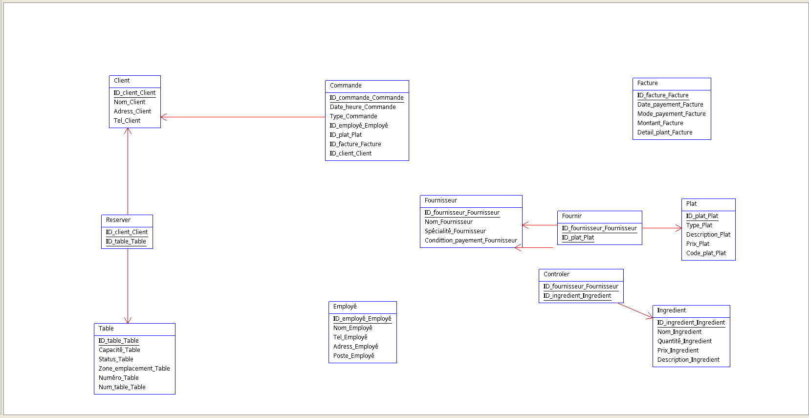

# 🍽️ Ombre d'afrique - Modélisation d'une base de données SQL

Ce projet consiste à concevoir et modéliser une base de données rélationnelles **Ombre d'Afrique**, qfin de gérer efficacement les commandes, les clients, les menus, les employés et les ingrédients.

## 📌 Objectifs du projet

- Concevoir un schéma relationnel clair et cohérant
- Implémenter la base de données en SQL (MySQL / PostgreSQL)
- Permettre une gestion fluide des opérations du restaurant
- Optimiser les requêtes pour les rapports et la prise de décisions

---

## 🧱 Structure de la base de données

### Tables principales :

- `Fournisseur´ : Gère les fournisseurs de produits ou ingrédients
- `Client´ : Contient les informations des clients
- `Table´ : Représente les tables physiques du restaurant
- `Employé´ : Informations sur le personnel
- `Plat´ : Liste des plats proposés
- `Commande´ : Commandes passées par les clients
- `Facture´ : Paiements associés aux commandes
- `Ingredient´ : Ingrédients utilisés dans les plats


### Relations
- Un client peut passer plusieurs commandes
- Une commande contient plusieurs plats
- Un plat est composé de plusieurs ingrédients
- Une réservation est liée à un client et à une table
- Un paiement est lié à une commande

---

## 🛠️ Technologies utilisées

-**SGBD** : MySQL 
- **Outils de modélisation** : draw.io / Analyse.SI
- **Langage SQL** : pour la création des tables, des relations et des requêtes

## 📊 Exemple de requêtes SQL
- liste des plats commandés par un client donné

```sql 
SELECT * p.Dessert_chocolatté, c.7_juin_2025
FROM commandes c
JOIN Commande_Plat cp ON c.id_commande = cp.id_commande
JOIN Plats p ON cp.id_commande = p.id_plat
WHERE c.id_client = 1;
```
--- 

📈 Évolutions possibles

* Ajout de statistiques sur les ventes
* Gestion des stocks et des fournisseurs


    


## Modéle Conceptuelle de Données

Ce schema decrit la conception de la base de donnees avec les relations qui existent entre les entites et les associations.


## Modéle Logique de Données
Cette figure répresente la modélisation logique :





##  structure complète d'une base de données relationnelle


```Script SQL
    
        
      DROP TABLE IF EXISTS Fournisseur ; CREATE TABLE Fournisseur (ID_fournisseur_Fournisseur BIGINT AUTO_INCREMENT NOT NULL, Nom_Fournisseur BIGINT, Spécialité_Fournisseur BIGINT, Condittion_payement_Fournisseur BIGINT, PRIMARY KEY (ID_fournisseur_Fournisseur)) ENGINE=InnoDB;  DROP TABLE IF EXISTS Client ; CREATE TABLE Client (ID_client_Client BIGINT AUTO_INCREMENT NOT NULL, Nom_Client BIGINT, Adress_Client BIGINT, Tel_Client BIGINT, PRIMARY KEY (ID_client_Client)) ENGINE=InnoDB;  DROP TABLE IF EXISTS Table ; CREATE TABLE Table (ID_table_Table BIGINT AUTO_INCREMENT NOT NULL, Capacité_Table BIGINT, Status_Table BIGINT, Zone_emplacement_Table BIGINT, Numéro_Table BIGINT, Num_table_Table BIGINT, PRIMARY KEY (ID_table_Table)) ENGINE=InnoDB;  DROP TABLE IF EXISTS Employé ; CREATE TABLE Employé (ID_employé_Employé BIGINT AUTO_INCREMENT NOT NULL, Nom_Employé BIGINT, Tel_Employé BIGINT, Adress_Employé BIGINT, Poste_Employé BIGINT, PRIMARY KEY (ID_employé_Employé)) ENGINE=InnoDB;  DROP TABLE IF EXISTS Plat ; CREATE TABLE Plat (ID_plat_Plat BIGINT AUTO_INCREMENT NOT NULL, Type_Plat BIGINT, Description_Plat BIGINT, Prix_Plat BIGINT, Code_plat_Plat BIGINT, PRIMARY KEY (ID_plat_Plat)) ENGINE=InnoDB;  DROP TABLE IF EXISTS Commande ; CREATE TABLE Commande (ID_commande_Commande BIGINT AUTO_INCREMENT NOT NULL, Date_heure_Commande BIGINT, Type_Commande BIGINT, ID_employé_Employé **NOT FOUND**, ID_plat_Plat **NOT FOUND**, ID_facture_Facture **NOT FOUND**, ID_client_Client **NOT FOUND**, PRIMARY KEY (ID_commande_Commande)) ENGINE=InnoDB;  DROP TABLE IF EXISTS Facture ; CREATE TABLE Facture (ID_facture_Facture BIGINT AUTO_INCREMENT NOT NULL, Date_payement_Facture BIGINT, Mode_payement_Facture BIGINT, Montant_Facture BIGINT, Detail_plant_Facture BIGINT, PRIMARY KEY (ID_facture_Facture)) ENGINE=InnoDB;  DROP TABLE IF EXISTS Ingredient ; CREATE TABLE Ingredient (ID_ingredient_Ingredient BIGINT AUTO_INCREMENT NOT NULL, Nom_Ingredient BIGINT, Quantité_Ingredient BIGINT, Prix_Ingredient BIGINT, Description_Ingredient BIGINT, PRIMARY KEY (ID_ingredient_Ingredient)) ENGINE=InnoDB;  DROP TABLE IF EXISTS Reserver ; CREATE TABLE Reserver (ID_client_Client **NOT FOUND** AUTO_INCREMENT NOT NULL, ID_table_Table **NOT FOUND** NOT NULL, PRIMARY KEY (ID_client_Client,  ID_table_Table)) ENGINE=InnoDB;  DROP TABLE IF EXISTS Fournir ; CREATE TABLE Fournir (ID_fournisseur_Fournisseur **NOT FOUND** AUTO_INCREMENT NOT NULL, ID_plat_Plat **NOT FOUND** NOT NULL, PRIMARY KEY (ID_fournisseur_Fournisseur,  ID_plat_Plat)) ENGINE=InnoDB;  DROP TABLE IF EXISTS Controler ; CREATE TABLE Controler (ID_fournisseur_Fournisseur **NOT FOUND** AUTO_INCREMENT NOT NULL, ID_ingredient_Ingredient **NOT FOUND** NOT NULL, PRIMARY KEY (ID_fournisseur_Fournisseur,  ID_ingredient_Ingredient)) ENGINE=InnoDB;  ALTER TABLE Commande ADD CONSTRAINT FK_Commande_ID_employé_Employé FOREIGN KEY (ID_employé_Employé) REFERENCES Employé (ID_employé_Employé); ALTER TABLE Commande ADD CONSTRAINT FK_Commande_ID_plat_Plat FOREIGN KEY (ID_plat_Plat) REFERENCES Plat (ID_plat_Plat); ALTER TABLE Commande ADD CONSTRAINT FK_Commande_ID_facture_Facture FOREIGN KEY (ID_facture_Facture) REFERENCES Facture (ID_facture_Facture); ALTER TABLE Commande ADD CONSTRAINT FK_Commande_ID_client_Client FOREIGN KEY (ID_client_Client) REFERENCES Client (ID_client_Client); ALTER TABLE Reserver ADD CONSTRAINT FK_Reserver_ID_client_Client FOREIGN KEY (ID_client_Client) REFERENCES Client (ID_client_Client); ALTER TABLE Reserver ADD CONSTRAINT FK_Reserver_ID_table_Table FOREIGN KEY (ID_table_Table) REFERENCES Table (ID_table_Table); ALTER TABLE Fournir ADD CONSTRAINT FK_Fournir_ID_fournisseur_Fournisseur FOREIGN KEY (ID_fournisseur_Fournisseur) REFERENCES Fournisseur (ID_fournisseur_Fournisseur); ALTER TABLE Fournir ADD CONSTRAINT FK_Fournir_ID_plat_Plat FOREIGN KEY (ID_plat_Plat) REFERENCES Plat (ID_plat_Plat); ALTER TABLE Controler ADD CONSTRAINT FK_Controler_ID_fournisseur_Fournisseur FOREIGN KEY (ID_fournisseur_Fournisseur) REFERENCES Fournisseur (ID_fournisseur_Fournisseur); ALTER TABLE Controler ADD CONSTRAINT FK_Controler_ID_ingredient_Ingredient FOREIGN KEY (ID_ingredient_Ingredient) REFERENCES Ingredient (ID_ingredient_Ingredient);
``` 

## une version simplifiée et lisible du schéma conceptuel de base de données relationnelle pour le restaurant Ombre d’Afrique


    ```
     
    # Modèle créé le : Mon Jul 07 14:04:46 WAT 2025  Fournisseur (ID_fournisseur_Fournisseur, Nom_Fournisseur, Spécialité_Fournisseur, Condittion_payement_Fournisseur)  Client (ID_client_Client, Nom_Client, Adress_Client, Tel_Client)  Table (ID_table_Table, Capacité_Table, Status_Table, Zone_emplacement_Table, Numéro_Table, Num_table_Table)  Employé (ID_employé_Employé, Nom_Employé, Tel_Employé, Adress_Employé, Poste_Employé)  Plat (ID_plat_Plat, Type_Plat, Description_Plat, Prix_Plat, Code_plat_Plat)  Commande (ID_commande_Commande, Date_heure_Commande, Type_Commande, #ID_employé_Employé, #ID_plat_Plat, #ID_facture_Facture, #ID_client_Client)  Facture (ID_facture_Facture, Date_payement_Facture, Mode_payement_Facture, Montant_Facture, Detail_plant_Facture)  Ingredient (ID_ingredient_Ingredient, Nom_Ingredient, Quantité_Ingredient, Prix_Ingredient, Description_Ingredient)  Reserver (ID_client_Client, ID_table_Table)  Fournir (ID_fournisseur_Fournisseur, ID_plat_Plat)  Controler (ID_fournisseur_Fournisseur, ID_ingredient_Ingredient)  
    ```

## Representation dans un terminal


    👨‍🍳 Auteur

       * Nom : Hadje Haoua Mahamat Issa
       * Passion : Developpement Web, bases de données, et projet inspirants 🌟